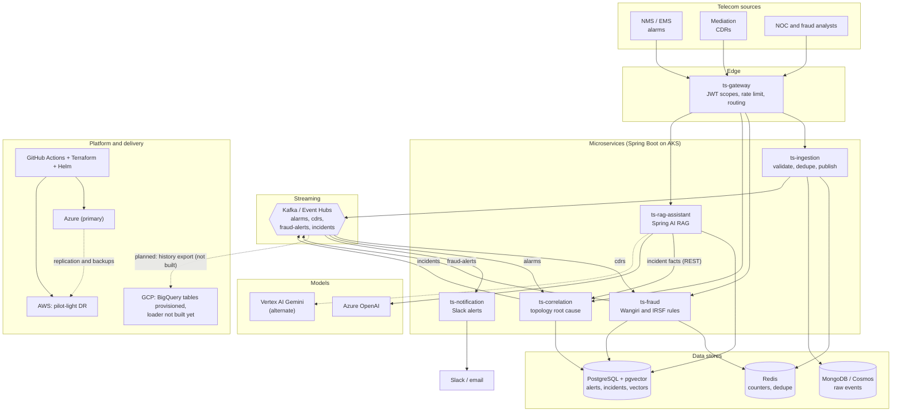

# TeleSentinel
**AI-Powered Real-Time Fraud Detection and Root Cause Analysis for Telecom Networks**

## 1. Brief description
TeleSentinel is a cloud-native platform for telecom operators that reads network alarms and call records in real time. It flags fraud (Wangiri and IRSF) as it happens, turns an alarm storm into one incident with a probable root cause, and lets engineers ask a GenAI assistant, grounded in their own runbooks, what to do next. It is built with Spring Boot and Spring AI, runs on Kubernetes (Azure primary, AWS standby, GCP for AI and analytics), and is deployed with Terraform, Helm and GitHub Actions.

> **Status:** version 0.1, a foundation to build on. It has unit tests but has not been compiled in CI, load tested, or proven in production.

## 2. Application stack
| Layer | Technology |
|---|---|
| Language and runtime | Java 21, Spring Boot 3.5.x |
| APIs and services | Spring Web (REST), Spring Cloud Gateway (2025.0), microservices |
| GenAI | Spring AI 1.1.x, explicit RAG (retrieve from pgvector, then prompt), Azure OpenAI (default) or Vertex AI Gemini |
| Messaging | Apache Kafka locally, Azure Event Hubs (Kafka protocol) in the cloud |
| Data | PostgreSQL 16 + pgvector (relational data and vectors), Redis (counters, dedupe, rate limits), MongoDB / Cosmos DB Mongo API (raw event audit) |
| Security | OAuth2/JWT resource server, scope-based access, Key Vault for secrets, non-root containers |
| Cloud | Azure (primary: AKS, ACR, managed data services, Azure OpenAI), GCP (Vertex AI, BigQuery), AWS (disaster recovery: EKS, RDS, ElastiCache, S3, Route 53) |
| Infrastructure as code | Terraform (three stacks plus a shared module) |
| Packaging and delivery | Docker (multi-stage), Helm, GitHub Actions (build, test, Trivy, CodeQL, Terraform plan/apply, Helm deploy) |
| Observability | Spring Actuator health and Prometheus endpoints (dashboards are a next step) |
| Testing | JUnit 5, Spring MockMvc |

## 3. Application architecture

**How to read it:** events enter through the gateway to `ts-ingestion`, which dedupes and publishes to Kafka. `ts-fraud` and `ts-correlation` consume independently, write their findings to PostgreSQL, and publish alerts and incidents back to Kafka. `ts-notification` pushes those to Slack. `ts-rag-assistant` retrieves runbook chunks from pgvector, pulls live incident facts from `ts-correlation`, and asks the model to explain. A deeper walkthrough of the design decisions is in [`docs/architecture.md`](docs/architecture.md).

## 4. What is this application all about?
TeleSentinel watches the two streams that hurt most when they go wrong: **network alarms** and **call detail records (CDRs)**.

- **Fraud side:** it reads CDRs in real time and flags Wangiri (one-ring callback scams) and IRSF (premium-rate revenue-share fraud) while the calls are still happening.
- **Network side:** when a fault triggers hundreds of alarms, it uses the network topology to collapse them into one incident with a probable root cause and an estimate of subscribers affected.
- **Assistant side:** a GenAI assistant, grounded in your own runbooks and fraud playbooks, explains each alert or incident and suggests the next troubleshooting steps.
- **Operations side:** alerts reach Slack, everything runs on Kubernetes, and a standby site on AWS covers a primary-cloud outage.

In short: it turns alarm noise and raw call records into a few clear, explained, actionable events for NOC and fraud teams.

## 5. How is this application different from other applications?
These are design choices, not claims about any specific vendor's product.

| Typical approach | TeleSentinel |
|---|---|
| Fraud tools and NOC tools are separate silos with separate data | One event pipeline (Kafka) feeds both fraud detection and alarm correlation, so one platform, one deployment, one assistant |
| An LLM is asked to "find the fraud" or "find the cause" | **Detection is deterministic** (rules and topology); the LLM only **explains**. Real-time decisions never wait on a model, and a model error cannot block a call or hide an outage |
| Alarm lists sorted by time or severity | **Topology-aware correlation**: an alarmed child under an alarmed parent is treated as a symptom, and incidents are ranked by subscribers affected |
| Generic chatbot with generic advice | **RAG over your runbooks**: answers cite the runbook they came from and say so when the runbooks do not cover something |
| Customer data sent to an external model as-is | Subscriber numbers are **masked** and free-text alarm fields are flattened and length-capped before any prompt is built |
| Alarm storms flood downstream systems | **Edge dedupe** in Redis drops repeats before they reach Kafka; keys preserve per-node and per-subscriber ordering |
| Single-cloud, DR as an afterthought | **Azure primary, AWS pilot-light DR, GCP for AI and analytics**, all as Terraform, with a written failover runbook |
| Provider lock-in on the model | Switch between **Azure OpenAI and Gemini** with a Maven profile (Spring AI abstraction) |

## 6. How is this application helpful for the end user?
**Who it is for:** operators, MVNOs, and telecom engineering teams that want an owned, extensible platform rather than a black box, and teams that want a realistic reference architecture for AI in telecom operations.

**What the end user gets**
- **Less alarm noise:** one incident instead of dozens of alarms, with the likely root node on top.
- **Faster triage:** the assistant gives runbook-based next steps, so junior engineers are not stuck waiting for a specialist.
- **Money protected sooner:** fraud alerts fire when the pattern crosses a threshold, with a score, a reason, and a recommended action.
- **Tunable, explainable rules:** thresholds live in configuration, and every alert says why it fired.
- **Control over data:** you host it, you choose the cloud and the model, and sensitive identifiers are masked toward the model.
- **Resilience:** a documented DR path rather than hope.
- **Extensible:** adding a fraud rule is one small class; adding a runbook is one API call.

**When it is not the right fit (yet):** this is version 0.1. It has not been load tested or proven in production, it ships with two fraud rules and a static topology file, and it does not replace a certified fraud management system or a vendor OSS where you need support contracts and regulatory sign-off. Treat it as a strong foundation to build on and validate.

## Sensitive data and placeholders
Every sensitive or environment-specific value in this repository is masked as `************************************`: the local development database password, tenant, project and account identifiers, endpoints, and allowed CIDR ranges. Real values must come from environment variables, a secret store (Key Vault, Secrets Manager), or your own untracked values files.
- Local development uses the masked string itself as the database password in `docker-compose.yml` and the service defaults, so it works out of the box. Override with `POSTGRES_PASSWORD` and `PG_PASSWORD` for anything beyond your laptop.
- Terraform generates all real passwords and keys and writes them to Key Vault; none are stored in code.
- Sample phone numbers in tests and `scripts/demo.sh` are fictitious.

## Reliability behaviour (what the code guarantees)
- **No silent loss on publish failure:** ingestion claims the dedupe key, waits for the Kafka ack, and releases the key if publishing fails (HTTP 503 with `Retry-After`), so the client's retry is accepted, not mistaken for a duplicate.
- **Durable alarm state:** active alarms live in PostgreSQL, so a correlation restart does not forget live faults or wrongly auto-resolve their incidents.
- **One spelling per subscriber:** numbers are canonicalised to a leading `+` at ingestion (send E.164), and the allow list is canonicalised the same way. Phone numbers are masked in fraud logs.
- **Alarm lifecycle:** alarms carry `status` `RAISED` (default) or `CLEARED`. A change of severity is an escalation and is not deduped. Alarms stay active until cleared (or until `active-alarm-ttl-seconds` with no repeat); incidents auto-resolve about 30 s after their alarms clear. A parent fault merges earlier child incidents into one.
- **Fraud counters are atomic:** Redis counters use Lua scripts that update and expire in one step, and repair a key that lost its TTL.
- **Idempotent CDR processing:** a redelivered CDR is not counted twice, and alert suppression keys are released if the alert cannot be stored, so Kafka retries still alert.
- **Alert triage:** `PATCH /api/v1/fraud/alerts/{id}/status` with `OPEN | CONFIRMED | FALSE_POSITIVE | RESOLVED`; calling numbers in `telesentinel.fraud.allow-list` are skipped.
- **Throughput:** `POST /api/v1/cdrs/batch` accepts up to 1000 CDRs and is safe to retry whole.
- **Assistant:** answers include `sources`; if no runbook matches, the model is not called and the response says so. Outbound HTTP calls have timeouts.
- **Gateway tokens:** both user tokens (`scp`) and app tokens (`roles`) map to the same authority names: `telemetry.write`, `noc.read`, `fraud.write`, `incidents.write`, `knowledge.write`. Tokens are also checked for issuer and **audience** (`JWT_AUDIENCE`, required at startup).
- **Data retention:** raw event audit copies in MongoDB expire after `telesentinel.retention.raw-events` (default 30 days).
- **Network:** Helm NetworkPolicies allow only the gateway (and the assistant to correlation) to call internal services.

## Services
| Service | Port | Role |
|---|---|---|
| `ts-gateway` | 8080 | Spring Cloud Gateway: JWT auth, scopes, Redis rate limiting, routing |
| `ts-ingestion` | 8081 | REST intake (single and batch) for alarms and CDRs, Redis dedupe, Mongo audit with retention, Kafka publish |
| `ts-fraud` | 8082 | Kafka consumer, Wangiri and IRSF rules (Redis), alerts in PostgreSQL |
| `ts-correlation` | 8083 | Topology-based root cause analysis, incidents in PostgreSQL |
| `ts-rag-assistant` | 8084 | Spring AI: ask questions, summarise incidents, explain fraud alerts |
| `ts-notification` | 8085 | Fraud alerts and incidents to Slack (log-only if no webhook) |

Architecture, decisions and limitations: [`docs/architecture.md`](docs/architecture.md). DR plan: [`docs/dr-runbook.md`](docs/dr-runbook.md). Infra: [`infra/terraform/README.md`](infra/terraform/README.md).
