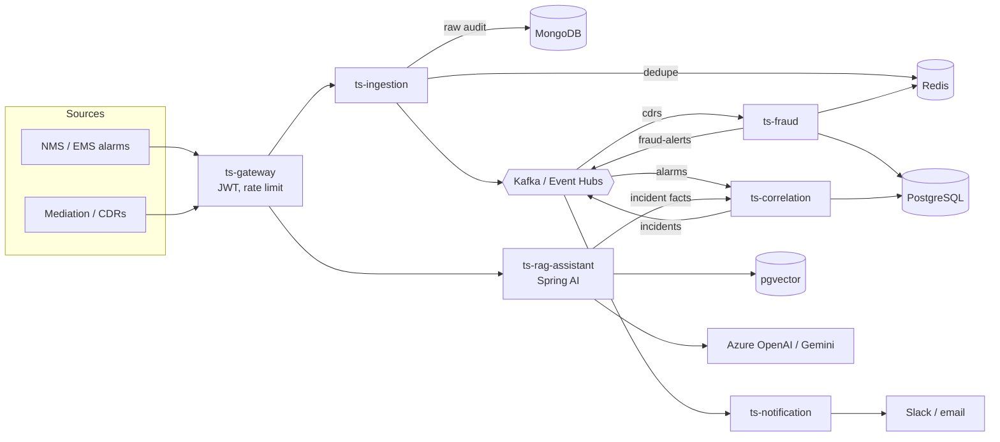

# TeleSentinel architecture

## Design decisions
- **Detection is deterministic, explanation is generative.** Fraud rules and topology correlation decide; the LLM only explains and suggests runbook steps. LLM latency and variability are unacceptable on the blocking path.
- **Partition keys preserve order.** Alarms are keyed by node id, CDRs by calling number, so each consumer sees one entity's events in order.
- **Dedupe at the edge.** Alarm storms repeat the same fault; Redis `SET NX` with a TTL drops repeats before they reach Kafka.
- **One database, one schema per service** (`fraud`, `correlation`, `public` for vectors). Services never read each other's tables; they use REST or Kafka.
- **PII minimisation toward the LLM.** Subscriber numbers are masked to the last four digits before prompts are built; free-text alarm fields are flattened and length-capped.
- **No secrets in Git or Helm values.** Terraform writes generated secrets to Key Vault; pods get them through a Kubernetes Secret created from there.

## Known limitations
Not solved in code yet (each needs a decision or an environment I do not have):

**Scaling and correctness**
- `ts-correlation` stores active alarms in PostgreSQL (restart-safe) but still evaluates on a timer in one process, so run **one replica**; two would create duplicate incidents. To scale out, partition by node and use a leader or per-partition ownership.
- Fraud windows use processing time, not the CDR's `startTime`, so late or back-filled CDRs distort counts. Fixed-window counters; use sorted sets for strict sliding windows.
- Topology comes from YAML. In production load it from your inventory/CMDB. Alarms from unknown nodes are logged once and treated as zero-subscriber roots.
- Numbers must be E.164 (a leading `+` is added if missing, but national-format numbers are not converted).
- Rules only alert: nothing blocks calls (needs integration with your SBC or policy engine).
- Kafka consumers retry with back-off, then log and drop; a dead-letter topic is the next step (topics must be pre-created on Event Hubs).

**Security and compliance**
- Event Hubs and Azure OpenAI are created with public endpoints (key-protected). Add private endpoints or network rules before production.
- No audit trail of who viewed or changed alerts. CDR numbers are stored in clear (with retention) and Redis keys contain numbers. Regulated deployments need identifier encryption and access logging.
- The Kubernetes Secret `telesentinel-secrets` is expected to exist; nothing in this repo syncs it from Key Vault (add External Secrets or the CSI driver).
- The RAG store has no per-document access control, and there are no answer-quality evaluations or token budgets.

**Platform**
- Spring Boot 3.5 support has reportedly ended and Spring AI 2.0 requires Boot 4 (see README status notes).
- Event Hubs compatibility of producer settings (`enable.idempotence`) should be verified for your SKU.
- DR: no network path from Azure to AWS yet (needed for PostgreSQL replication), and no jobs that create Mongo dumps or load history into BigQuery.
- Terraform state backends must be bootstrapped manually, and the CI `apply` job is a placeholder.
- Not load tested. Before sizing, test ingestion and fraud with realistic CDR rates and Kafka partition counts.
